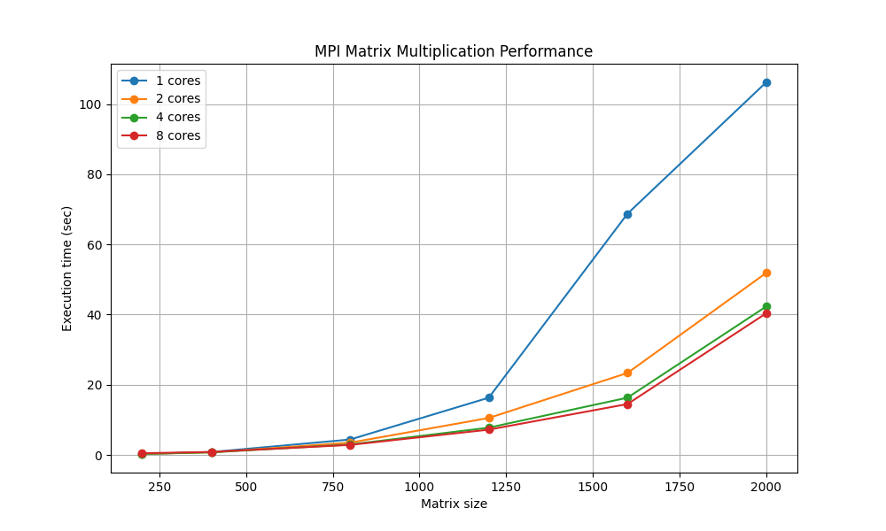

# parallel_programming
Параллельное программирование ИБАС 2 курс

6212-100503D Дмитриева Алина

---

# Лабораторная работа №3

## Тема
Параллельное умножение матриц с использованием MPI.

---

# Цель работы

Изучить основы параллельного программирования с использованием технологии MPI и реализовать алгоритм параллельного умножения матриц на языке C++.

---

# Используемые технологии

- C++
- MPI (Microsoft MPI)
- Visual Studio 2022
- Python
- matplotlib
- numpy

---

# Описание программы

Программа реализует параллельное умножение двух квадратных матриц.

Каждый MPI-процесс получает часть строк первой матрицы и выполняет вычисление соответствующего блока результирующей матрицы.

Основные этапы работы программы:

1. Чтение матриц из файлов
2. Передача данных между MPI-процессами
3. Параллельное вычисление произведения матриц
4. Сбор результатов на процессе с рангом 0
5. Сохранение результирующей матрицы в файл
6. Измерение времени выполнения

---

# Алгоритм распараллеливания

Распараллеливание реализовано по строкам матрицы:

- матрица делится между MPI-процессами;
- каждый процесс вычисляет собственный диапазон строк;
- после завершения вычислений результаты отправляются процессу 0;
- процесс 0 собирает итоговую матрицу.

---

# Компиляция программы

```bash
cl /EHsc main.cpp /I"C:\Program Files (x86)\Microsoft SDKs\MPI\Include" /link /LIBPATH:"C:\Program Files (x86)\Microsoft SDKs\MPI\Lib\x64" msmpi.lib
```

---

# Запуск программы

```bash
mpiexec -n 4 main.exe matrix1.txt matrix2.txt result.txt
```

где:

- `-n 4` — количество MPI-процессов;
- `matrix1.txt` — первая матрица;
- `matrix2.txt` — вторая матрица;
- `result.txt` — результирующая матрица.

---

# Верификация и тестирование

Для тестирования был разработан Python-скрипт, который:

- автоматически генерирует случайные матрицы;
- запускает программу с различным количеством MPI-процессов;
- измеряет время выполнения;
- сохраняет результаты в CSV-файл;
- строит график зависимости времени выполнения от размера матрицы.

Тестирование выполнялось для:

- 1 процесса
- 2 процессов
- 4 процессов
- 8 процессов

Размеры матриц:

- 200×200
- 400×400
- 800×800
- 1200×1200
- 1600×1600
- 2000×2000

---

# Полученные результаты

## Таблица измерений

| Размер матрицы | 1 ядро | 2 ядра | 4 ядра | 8 ядер |
|---|---|---|---|---|
| 200 | 0.268 | 0.279 | 0.318 | 0.485 |
| 400 | 0.831 | 0.735 | 0.742 | 0.861 |
| 800 | 4.390 | 3.495 | 2.978 | 2.859 |
| 1200 | 16.317 | 10.537 | 7.777 | 7.206 |
| 1600 | 68.752 | 23.360 | 16.319 | 14.506 |
| 2000 | 106.215 | 51.870 | 42.305 | 40.364 |

---

# График производительности

График зависимости времени выполнения от размера матрицы:



---

# Анализ результатов

## Малые размеры матриц

Для матриц размером 200×200 и 400×400 ускорение практически отсутствует.

Причина:

- накладные расходы MPI;
- затраты на передачу данных между процессами;
- синхронизация процессов.

При малых объёмах вычислений стоимость обмена данными превышает выигрыш от распараллеливания.

---

## Средние размеры матриц

Для матриц 800×800 и 1200×1200 наблюдается заметное ускорение.

Например:

- 800×800:
  - 1 ядро: 4.39 сек
  - 8 ядер: 2.86 сек

- 1200×1200:
  - 1 ядро: 16.32 сек
  - 8 ядер: 7.21 сек

Ускорение становится эффективным, так как вычислительная нагрузка начинает преобладать над затратами на коммуникацию.

---

## Большие размеры матриц

На матрицах 1600×1600 и 2000×2000 распараллеливание показывает максимальную эффективность.

Пример:

- 2000×2000:
  - 1 ядро: 106.21 сек
  - 8 ядер: 40.36 сек

Ускорение:

```text
106.21 / 40.36 ≈ 2.63 раза
```

Несмотря на использование 8 процессов, ускорение не достигает линейного значения из-за:

- передачи данных между процессами;
- ограничений памяти;
- затрат на сбор результатов;
- дисбаланса нагрузки;
- накладных расходов MPI.

---

# Вывод

В ходе лабораторной работы:

- была изучена технология MPI;
- реализовано параллельное умножение матриц;
- выполнено тестирование производительности;
- проведён анализ эффективности распараллеливания.

Результаты показали, что:

- использование MPI эффективно для больших объёмов вычислений;
- при увеличении размера матрицы ускорение возрастает;
- накладные расходы MPI существенно влияют на производительность при малых размерах задач.

Таким образом, параллельное программирование позволяет значительно сократить время выполнения ресурсоёмких вычислений.

---

# Список используемых источников

1. Документация MPI  
2. Microsoft MPI Documentation  
3. Документация Visual Studio 2022  
4. Документация Python matplotlib  
5. Документация numpy