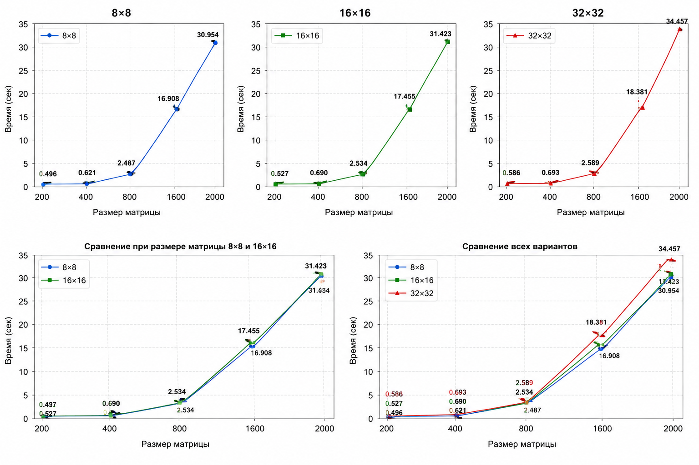

## 4ая Лабораторная
Дмитриевой Алины 6212-100503D
## Результаты CUDA-экспериментов

| Размер матрицы | 8×8 | 16×16 | 32×32 |
|---------------|-----|-------|-------|
| 200 | 0.496 | 0.527 | 0.586 |
| 400 | 0.621 | 0.690 | 0.693 |
| 800 | 2.487 | 2.534 | 2.589 |
| 1600 | 16.908 | 17.455 | 18.381 |
| 2000 | 30.954 | 31.423 | 34.457 |

## Графики

## Вывод
По заданию первая лабораторная была модернизирована под систему CUDA, для чего были добавлены дополнительные вспомогательные файлы и реализована работа с GPU.
Во время экспериментов стало видно, что выбор размеров блоков напрямую влияет на скорость вычислений, особенно при работе с большими матрицами.
Проведённые тесты показали, что использование технологии CUDA позволяет значительно ускорить процесс умножения матриц за счёт распараллеливания вычислений на GPU. При увеличении размера матриц разница в производительности между обычной версией программы и CUDA-реализацией становилась ещё более заметной.

Таким образом, цель лабораторной работы была достигнута: программа из первой лабораторной работы успешно адаптирована для параллельного выполнения с использованием CUDA, проведены эксперименты с разными размерами матриц и конфигурациями блоков, а корректность вычислений подтверждена автоматизированной проверкой результатов.
