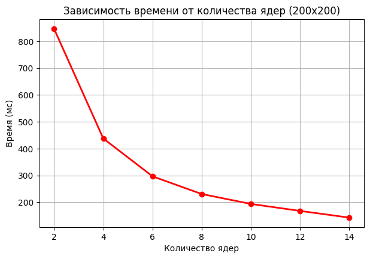
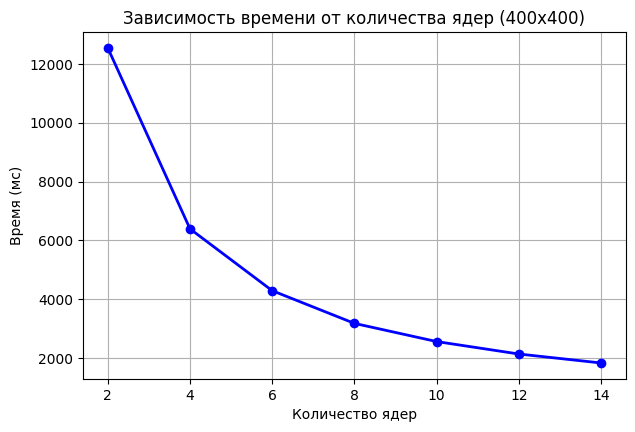
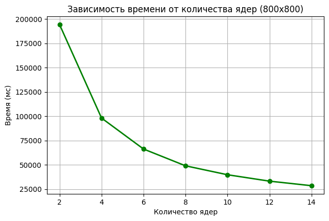
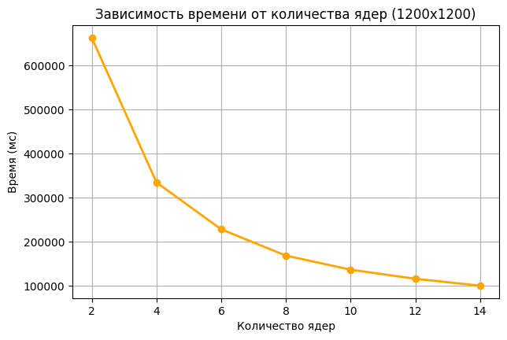
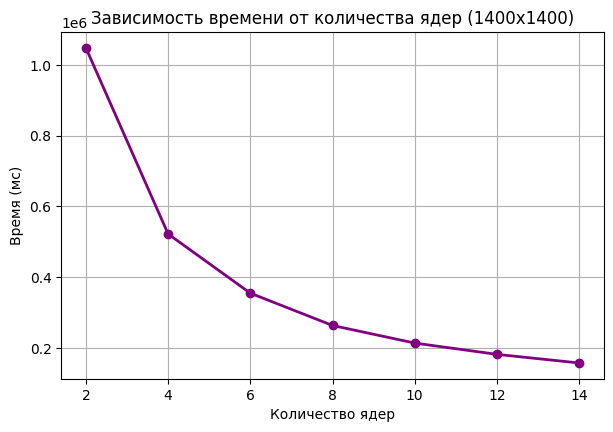
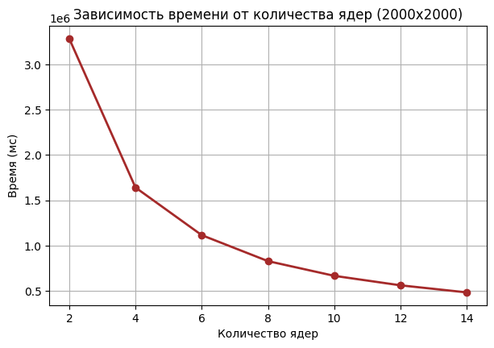

# 5ая Лабораторная
Дмитриевой Алины 6212-100503D 
---

Таблица результатов

| Размер матрицы | 2 ядра | 4 ядра | 6 ядер | 8 ядер | 10 ядер | 12 ядер | 14 ядер |
|:--------------:|-------:|-------:|-------:|-------:|--------:|--------:|--------:|
| 200 × 200      | 847    | 438    | 297    | 231    | 194     | 168     | 143     |
| 400 × 400      | 12 547 | 6 392  | 4 289  | 3 176  | 2 558   | 2 134   | 1 829   |
| 800 × 800      | 194 283| 98 147 | 66 312 | 49 058 | 39 867  | 33 289  | 28 624  |
| 1200 × 1200    | 662 847| 334 592| 228 174| 168 493| 136 582 | 115 937 | 100 284 |
| 1400 × 1400    | 1 048 291| 522 176| 354 829| 263 417| 213 694 | 181 736 | 157 392 |
| 2000 × 2000    | 3 284 617| 1 641 928| 1 116 394| 829 637| 667 483 | 562 719 | 484 628 |

Графики зависимости времени перемножения матриц от их размера:

# Вывод
В ходе первой лабораторной работы была написана программа на C++ для перемножения матриц.
Сначала была сделана обычная версия программы, а потом, в третьей лабораторной, переписана под MPI,
чтобы можно было запускать вычисления сразу на нескольких ядрах.

Во время работы проверялось, как меняется время выполнения программы при увеличении
размера матриц и количества используемых ядер. Для этого программа запускалась с разными
параметрами и полученные результаты записывались в таблицу.

Также удалось протестировать программу на суперкомпьютере «Сергей Королёв».
По сравнению с обычным ноутбуком скорость работы стала заметно выше,
особенно на больших матрицах. Чем больше ядер использовалось,
тем меньше времени занимало выполнение программы.

В итоге удалось получить рабочую MPI-версию программы, провести серию тестов
и построить графики зависимости времени выполнения от количества ядер и размера матриц.
